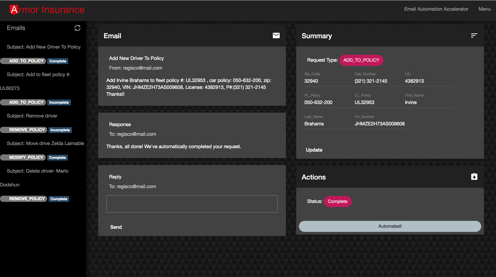

# Email Automation Accelerator

## Overview

This Accelerator showcases Watson powered automation for email actions and responses. It leverages Watson Conversation Service to identify the intent of the email, then uses a Watson Knowledge Studio custom annotation model through Natural Language Understanding to extract key information for automating requests.



## Team

This Accelerator was built by the Watson Accelerators Team. The original idea for the Accelerator was formed during a brainstorming session between the Watson Accelerators Team and (ANNA, who was the other group?)...

#### Watson Accelerators Team Contributors
- [Anna Quincy](https://www.linkedin.com/in/anna-quincy-25042957)
- [Jackson Vaughan](https://www.linkedin.com/in/jacksonvaughan/)

# Description

The Accelerator demonstrates two email automation scenarios; the first is automating the addition of drivers to insurance policies and the second is automating tickets for workstation management departments. You can switch between the two scenarios with the menu dropdown at the top right of the nav bar.

### Dashboard Overview
The Accelerator starts with a dashboard overview of the emails in the system, their current status, the requests that were made (identified by WCS) and a brief breakdown of the entities (extracted with WKS through NLU). You can view the emails by clicking on the 'View Email' button at the end of the page.

### Emails Sidebar
All the emails are displayed on the left nav with their Subject, Status, and request type (again, determined by WCS). Each email can be clicked to be viewed.

### Email Overview
Viewing an email displays:
- the given email from the sender
- a summary of the entities extracted by WKS with NLU along with the intent identified
- an actions tab for items still missing and submission if everything is valid
- and a response area for writing and viewing sent replies (prewritten replies will be populated to include missing items and an automatic thank you email will be sent back for emails with no missing items)

# Required Services

This Accelerator requires 2 services, and a product. You can reuse services by binding existing services to this application.

- Watson Knowledge Studio (https://www.ibm.com/us-en/marketplace/supervised-machine-learning)
- Watson Conversation Service (https://www.ibm.com/watson/developercloud/conversation.html)
- Watson Natural Language Understanding (https://www.ibm.com/watson/services/natural-language-understanding/)

# Setup Instructions


The setup is done in 3 primary steps. You will download the code, configure the code and then deploy the code to Bluemix. If you would like to run the code locally, there will be one more step to configure the credentials locally.

> Think of a name for your application.  The name must be unique within Bluemix, otherwise it won't deploy. This name will be used in a number of steps to get the application up and running.

## Prerequisites
The application requires the following applications

1. Node (6.9+) Application runtime environment
2. NPM (3.10+) Server side dependency management
3. Gulp (3.9+) `npm install -g gulp`
4. Angular CLI (1.0.0+) `npm install -g @angular/cli`

Note: Please read the upgrade instructions for Angular CLI when you upgrade or install the component.

## Downloading the code

1. Clone the app to your local environment from your terminal using the following command:
  `
  git clone https://github.ibm.com/Watson-Solutions-Lab/integrated-virtual-agent.git
  `
2. `cd` into this newly created directory
3. Edit the manifest.yml file and replace the name and host values ```integrated-virtual-agent``` with our own unique name you came up with.
4. Save the manifest.yml file.
5. Edit the package.json file and modify the application name as well.

## Setting up Bluemix

1. If you do not already have a Bluemix account, [sign up here](https://console.ng.bluemix.net/registration).
2. Log into Bluemix with your own credentials.
3. Create a new application by clicking on the Create App button on the Bluemix Dashboard.
4. On the left navigation, select Cloud Foundry Apps.
5. Click on the SDK for Node.js option on the right.
6. Enter your unique application name you though of before and click the Create button.
7. Wait until the application is started and available.
8. From the Bluemix Dashboard, select the newly created application.
9. Select Connections on the left.

### Create the following services using the procedure below

> Natural Language Understanding

> Conversation

1. Click on the Connect new button.
2. Search for the service you would like to create.
3. Create the service using the free, light or standard plans.
4. Bind it to your application.
5. Restage the application.

### Adding Service Credentials
Ensure to add your credentials to the env-vars.json:
```
"CONVERSATION0_API_URL": {"expr": "Conversation.*", "field": "credentials.url", "append": "/v1/workspaces/ {ENTER WORKSPACE HERE} /message?version=2016-09-20"},

"CONVERSATION1_API_URL": {"expr": "Conversation.*", "field": "credentials.url", "append": "/v1/workspaces/ {ENTER WORKSPACE HERE} /message?version=2016-09-20"},

"NATURAL_LANGUAGE_USERNAME0": " { ENTER USERNAME HERE }",

"NATURAL_LANGUAGE_PASSWORD0": " { ENTER PASSWORD HERE }",

"NATURAL_LANGUAGE_USERNAME1": " { ENTER USERNAME HERE }",

"NATURAL_LANGUAGE_PASSWORD1": " { ENTER PASSWORD HERE }",
```

You will also need to add your conversation credentials into the vcap-local.json file. Add it exactly as it is displayed when you view service credentials through bluemix, with added [] square brackets around. It should look similar to this:

```
{
  "conversation": [{
    "credentials": {
      "url": "https://gateway.watsonplatform.net/conversation/api",
      "username": "",
      "password": ""
    },
    "syslog_drain_url": null,
    "label": "conversation",
    "provider": null,
    "plan": "free",
    "name": "",
    "tags": [
      "watson",
      "ibm_created"
    ]
  }]
}
```

You will notice two sets of credentials for each service. These different credentials are for the two different demo scenarios in the application. If you just want to use one scenario you can make all credentials the same; otherwise you will need to create a second NLU service and a second WCS workspace (note: not another service instance, just a new workspace).

### WKS Setup

To be completed by Anna.

## Building the application

For the application to run on Bluemix or locally, it needs to be built first. To do that, the Prerequisites needs to be met and install must have been executed successfully.

From the App folder, run the command `gulp build`.

This will build the code into a folder called dist that will contain 3 sub-folders.  If any error occurred, then the build wasn't successful and is probably a dependency issue or install that wasn't ran or successful.

## Running the app on Bluemix

1. Open the `manifest.yml` file and change the `name` and `host` values to your application name.

  The host you choose will determinate the subdomain of your application's URL:  `<host>.mybluemix.net`

2. Connect to Bluemix in the command line tool and follow the prompts to log in

  ```
  $ cf login -a https://api.ng.bluemix.net
  ```
3. Push the app to Bluemix, but don't start it yet.  We would need to bind the services to the new application before starting it up.

  ```
  $ cf push
  ```

4. The application should now be running on Bluemix.  You can access the application URL using the application name you defined in the manifest.yml file with a '.mybluemix.net' appended to it.

7. The application is secured with a username and password.

8. Continue to the next step to do some additional configuration within the application.

## Running the app locally

To run the application locally (your own computer), you have to install additional Node.js modules and configure the application with some credentials that is provisioned on Bluemix.

### Starting the application
There are a few quick steps required to stand up the application. In general, the required tasks are.

1. Install the server and client dependencies
2. Commission the required services
3. Configure the environment variables in manifest.yml (cloud deployment) or .env (local deployment)
4. Build and run or deploy

#### Installing the server and client dependencies
The server dependencies are controlled and defined in [the main package.json](./package.json).

The client dependencies are controlled and defined in [the client package.json](./client/package.json).

To install all required dependencies to both build the application and execute the application, execute the following script from the project root.

Linux/Unix/MacOs

```
sh ./install.sh
```
or Windows

```
./install.bat
```

Alternatively, the dependencies can be installed manually with the following commands from project root

```
npm install
```

(cd client/ && npm install)

## Run the Application

Once all the credentials are in place, the application can be starter with ```gulp develop```.

## Accessing the Application

You can access the application with credentials  `watson\p@ssw0rd`

The user names and passwords can be modified in the /server/boot/init-access.js file.
